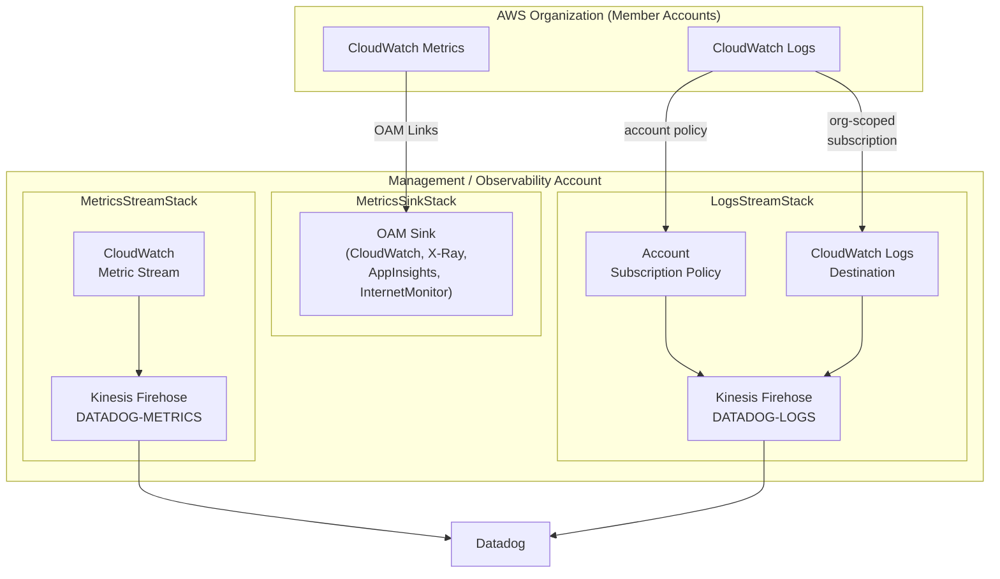

# aws-datadog-shipping-infra

This repository provides the infrastructure for shipping CloudWatch metrics and logs from AWS to Datadog. It deploys a set of nested CloudFormation stacks that together establish a centralized observability pipeline for an AWS Organization.

## Architecture Overview

The infrastructure is composed of three nested stacks managed by a root SAM template (`template.yaml`). Together they create two shipping pipelines:

- **Metrics pipeline**: CloudWatch Metric Streams → Kinesis Data Firehose → Datadog
- **Logs pipeline**: CloudWatch Logs (account-level subscription) → Kinesis Data Firehose → Datadog

Metrics are streamed from the management account and include linked account metrics from across the organization. Logs are collected organization-wide via a shared CloudWatch Logs destination that member accounts can subscribe to.

## CloudFormation Templates

### `template.yaml` — Root stack

The root SAM template. It accepts the top-level parameters and composes the three nested stacks.

| Parameter | Description |
|---|---|
| `AwsOrgId` | AWS Organization ID, used to scope cross-account IAM policies |
| `DatadogSite` | Datadog ingestion site (e.g. `us5.datadoghq.com`) |
| `DatadogApiKey` | Datadog API key (stored as `NoEcho`) |

The root stack passes these parameters down to the appropriate nested stacks. No resources are created directly in the root stack.

---

### `stacks/metrics-stream-template.yaml` — Metrics streaming stack

Deploys the CloudWatch Metric Stream and Kinesis Firehose delivery pipeline that ships CloudWatch metrics to Datadog in OpenTelemetry format.

**Key resources:**

| Resource | Type | Purpose |
|---|---|---|
| `DatadogMetricStreamAllNamespaces` | `AWS::CloudWatch::MetricStream` | Streams all CloudWatch metrics (excluding `AWS/Config` and `AWS/Usage`) to Firehose; includes linked account metrics from the organization |
| `DatadogMetricKinesisFirehose` | `AWS::KinesisFirehose::DeliveryStream` | Delivers metrics to the Datadog HTTP endpoint (`DATADOG-METRICS`) |
| `DatadogStreamBackupBucket` | `AWS::S3::Bucket` | S3 backup bucket for failed Firehose deliveries (KMS-encrypted, public access blocked) |
| `CloudWatchMetricsStreamRole` / `Policy` | IAM | Allows CloudWatch Metric Streams to put records into Firehose |
| `FirehoseMetricsRole` / `Policy` | IAM | Allows Firehose to write to S3 |
| `DatadogStreamLogs` | `AWS::Logs::LogGroup` | Firehose delivery and backup log streams (`/aws/kinesisfirehose/DATADOG-METRICS`) |

The metric stream uses an **exclusion filter** to drop the `AWS/Config` and `AWS/Usage` namespaces. Extended percentile statistics are pre-configured for latency-sensitive namespaces (ALB, ELB, S3, API Gateway, Lambda, Step Functions, AppSync, App Runner).

---

### `stacks/metrics-sink-template.yaml` — CloudWatch OAM sink stack

Deploys an [CloudWatch Observability Access Manager (OAM)](https://docs.aws.amazon.com/OAM/latest/APIReference/Welcome.html) sink in the central account. Member accounts in the organization link to this sink to share their CloudWatch metrics, X-Ray traces, Application Insights applications, and Internet Monitor data, making them visible to the metric stream in this account.

**Key resources:**

| Resource | Type | Purpose |
|---|---|---|
| `OamSink` | `AWS::Oam::Sink` | Org-scoped sink that accepts `CreateLink` / `UpdateLink` from any account in the organization |

The sink policy restricts links to the following resource types:
- `AWS::CloudWatch::Metric`
- `AWS::XRay::Trace`
- `AWS::ApplicationInsights::Application`
- `AWS::InternetMonitor::Monitor`

CloudWatch Log Groups are intentionally excluded — logs are shipped directly from member accounts via the logs stream.

---

### `stacks/logs-stream-template.yaml` — Logs streaming stack

Deploys the Kinesis Firehose delivery pipeline and CloudWatch Logs destination for shipping logs to Datadog. An account-level subscription policy automatically subscribes all log groups in the management account. Member accounts can subscribe their log groups to the shared destination.

**Key resources:**

| Resource | Type | Purpose |
|---|---|---|
| `DatadogDeliveryStream` | `AWS::KinesisFirehose::DeliveryStream` | Delivers logs to the Datadog HTTP endpoint (`DATADOG-LOGS`), with GZIP compression and 60-second buffering |
| `CloudWatchAccountPolicy` | `AWS::Logs::AccountPolicy` | Account-level subscription filter policy that routes all log groups (except the Firehose log group itself) to the delivery stream |
| `DatadogLogsDestination` | `AWS::Logs::Destination` | Org-scoped CloudWatch Logs destination (`DATADOG-LOGS-FIREHOSE`) that member accounts can subscribe to |
| `FailedDataBucket` | `AWS::S3::Bucket` | S3 backup for failed log deliveries |
| `CloudWatchLogsRole` / `Policy` | IAM | Allows CloudWatch Logs to put records into Firehose |
| `FirehoseLogsRole` / `Policy` | IAM | Allows Firehose to write to S3 and emit CloudWatch log events |
| `DeliveryStreamLogGroup` | `AWS::Logs::LogGroup` | Firehose delivery logs (`/aws/kinesisfirehose/DATADOG-LOGS`) |

**Outputs:**

| Output | Description |
|---|---|
| `DatadogDeliveryStreamARN` | Firehose ARN — use as the destination in CloudWatch Logs subscription filters |
| `CloudWatchLogsRoleARN` | IAM role ARN — use as `role-arn` in CloudWatch Logs subscription filters |
| `FailedDataBucketName` | Name of the S3 bucket where failed deliveries are stored |
